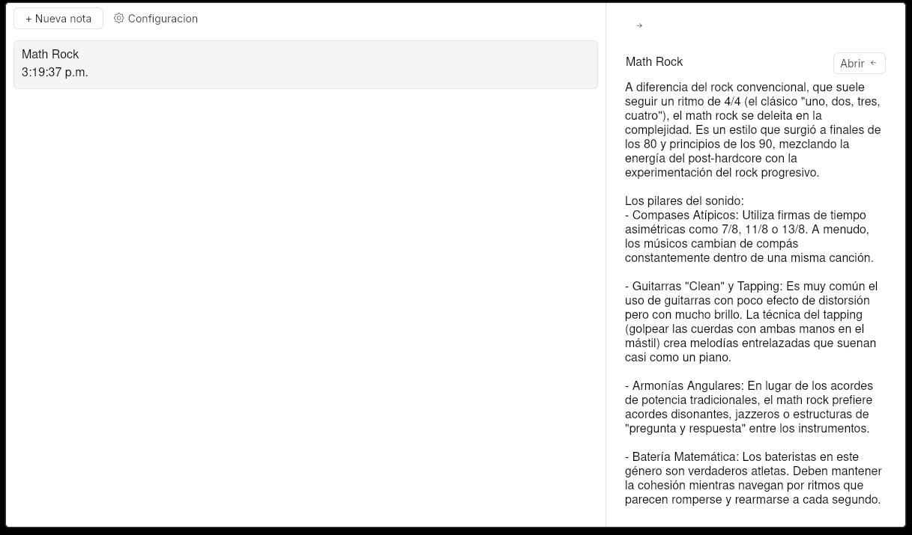
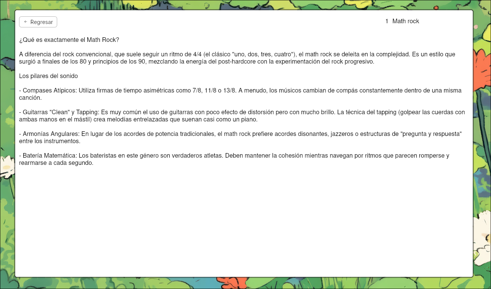

# VOID NOTES




> Aplicación de escritorio minimalista para tomar notas, diseñada para entornos Linux con Hyprland.

---

## ✨ Funcionalidades

- Crear y editar notas
- Guardado automático mientras escribes
- Panel lateral preview para ver el contenido sin abrir la nota
- Animaciones suaves entre notas
- Interfaz limpia y minimalista pensada para entornos tiling

---

## 🛠️ Tecnologías

- **Python** — lógica del backend y API
- **pywebview** — puente entre Python y la interfaz web
- **SQLite** — base de datos local
- **HTML / CSS / JavaScript** — interfaz de usuario

---

## 📦 Instalación

### Descargar ejecutable

1. Ve a la sección de [Releases](https://github.com/Gxstavo-dev/Void-notas/releases)
2. Descarga el archivo `void-notas-v1.0.0-linux.zip`
3. Descomprime el archivo
```bash
unzip void-notas-v1.0.0-linux.zip
```
4. Dale permisos de ejecución y corre la app
```bash
chmod +x main/main
./main/main
```

---

### Desde el código fuente

#### Requisitos

- Python 3.x
- pip
- webkit2gtk (requerido por pywebview en Linux)

```bash
# Dependencias del sistema
sudo pacman -S python-gobject webkit2gtk  # Arch / Hyprland
# o
sudo apt install python3-gi gir1.2-webkit2-4.0  # Debian / Ubuntu
```

```bash
# Clona el repositorio
git clone https://github.com/Gxstavo-dev/Void-notas.git
cd Void-notas

# Instala dependencias de Python
pip install pywebview

# Ejecuta la app
python main.py
```

---

## 📁 Estructura del proyecto

```
Void-notas/
├── Api/          # API Python (CRUD de notas)
├── Database/     # Conexión con SQLite
├── src/          # Interfaz web (HTML, CSS, JS)
├── assets/       # Imágenes y recursos
├── main.py       # Punto de entrada
└── .gitignore
```

---

## 👤 Autor

**Gxstavo-dev** — [github.com/Gxstavo-dev](https://github.com/Gxstavo-dev)